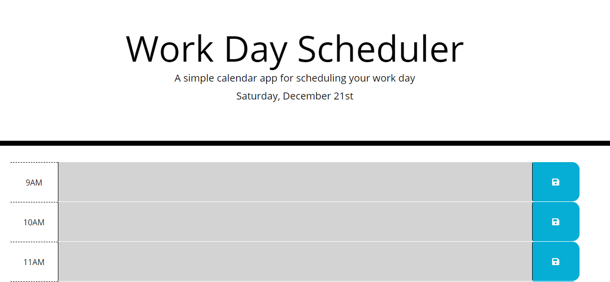
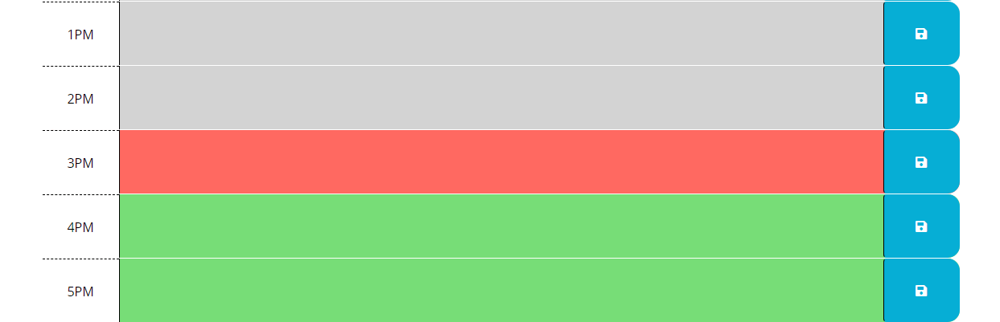

# Planner

This application is a simple webpage that utilizes Moment to create a planner. JQuery serves as the front-end of the application. A user can enter a plan and save it by clicking the save button on the right hand side. 

## Built With

* JavaScript
* HTML/CSS
* jQuery
* Moment

## Pages

### Planner

The webpage to create a plan for your day.

### View Plan

Hour backgrounds are based on time computed by using Moment.

https://chaselipscomb.github.io/Planner/